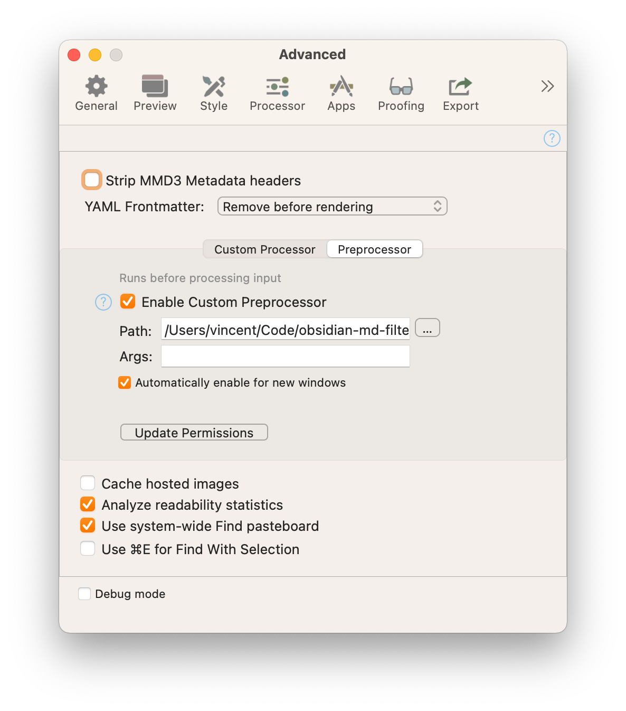

# Obsidian Markdown Filter

## Introduction

Takes an [Obsidian](https://obsidian.md) Markdown file and processes it for viewing in [Marked 2](https://marked2app.com). Set this script as a custom preprocessor in Marked 2 to make it work:



## Overview

What does the filter do? The main idea is that the output of the filter is a document that can live on its own, outside of an Obsidian vault. To achieve that, it: 

- Adds the filename as a level 1 title at the top, if enabled (see Settings below).
- Strips any YAML front matter (I can never get it to work reliably in Marked 2 itself)
- Strips HTML comments
- Replaces internal Obsidian links with just the text of the link, or with Obsidian links, based on settings.
    - If `obsidian_links` is set to `true`
        - `[[Link to other page|Alias]]` becomes `[Alias](obsidian url to other page)`
        - `[[Link to other page]]` becomes `[Link to other page](obsidian url to other page)`
        - `[[Link to other page#Reference]]` becomes `[Link to other page > Reference](obsidian url to "other page" with anchor)`
        - `[[#Reference]]` becomes `[Reference](#reference)`. This will only work if the Processor in Marked is set to Discount (GFM).
    - If `obsidian_links` is false or not set
        - `[[Link to other page|Alias]]` becomes `Alias`
        - `[[Link to other page]]` becomes `Link to other page`
        - `[[Link to other page#Reference]]` becomes `Link to other page > Reference`
        - `[[#Reference]]` becomes `Reference`
- `#tag` gets styled as a tag in Marked Preview
- Replaces transclusions with IA Writer block syntax
    - `![[File to include]]` becomes `/path/to/File to include.extension`
- Strips block IDs from the content
    - `Text ending with ^block-id` becomes `Text ending with`
- Strips emojis from the content, if enabled (see Settings below)
    - `👨🏻‍💻 Foo bar` becomes `Foo bar`
    
In case the document being previewed is not in an Obsidian vault, this processor does nothing.

## Transclusions

- A transclusion only works if the instruction is on a single line, all by itself. Obsidian is more flexible, but Marked 2 is not. I don't want to rewrite the source content too much.
- Transclusions don't work if the referenced file doesn't exist or has multiple matches in the Obsidian vault.
- Transcluded files are not processed themselves. So, nested transclusion don't work. According to the Marked 2 documentation it should work, but that's not my experience. I haven't looked into it further.
- I chose to use the IA Writer block syntax for three reasons:
    1. It has the cleanest syntax in my opinion.
    2. It works for many different file types.
    3. I use iA Writer myself, next to Obsidian, so I'm familiar with it.

## Obsidian vaults

This filter looks for the vault the file being processed is in by locating the `.obsidian` directory in the directory structure, going upward from the current file. If this directory can't be found, the file being processed is considered not to be in a vault, in which case the filter does nothing.

## Resolving internal links

The way the filter resolves references in `[[internal links]]` is by globbing for `**/internal links*`, starting from the root of the vault. This is **not** the same as what Obsidian does, but it works perfectly for me, because every one of my files has a name that is unique across the entire vault, allowing me to move files around within the vault without breaking anything.

Your mileage may vary though.

## Settings

The filter can be configured per-vault by putting a file `.obsidian-md-filter` in the root of the vault. This must be a YAML file. Currently it supports the following settings:

```yaml
strip_emojis: true
add_title: true
convert_tags: true
obsidian_links: true
convert_markdown_links: true
marked_processor: discount
```

- `strip_emojis`: remove emojis in the preview
- `add_title`: include the title of the note as an H1 in the preview 
- `convert_tags`: convert `#tags` to styled tags in preview
- `obsidian_links`: if true, links in the document are converted to `obsidian://` urls and will open the linked notes in Obsidian
- `convert_markdown_links`: if true, links created in the "portable" format (`[label](link)`) will be converted to `obsidian://` links. Only use this if you don't have `[[wikilinks]]` as your default link type
- `marked_processor`: can be set to `mmd` or `multimarkdown` to remove spaces from the slug (#My anchor => Myanchor), which is compatible with the way MultiMarkdown creates anchors from headlines. Any other value will generate anchors as hyphenated slugs (#My anchor => my-anchor).
